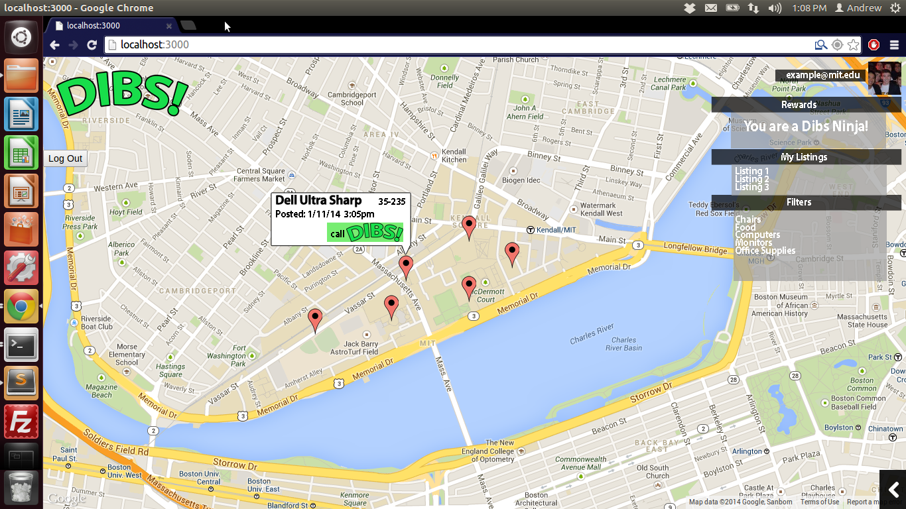

Team Dibs: Milestone 1 
=========

<strong>Members: Julian Contreras, Danielle Man, Andrew Mikofalvy</strong>

Dibs is a reuse enhancement suite designed for the MIT community.

The Problem
----

reuse@mit.edu is an email list that nearly all MIT students subscribe to or at least hear about when they first arrive on campus. The MIT Reuse lists contribute to MIT’s green initiative and it has the additional benefit of helping students explore campus and meet new people.

Unfortunately, many students choose to unsubscribe from reuse or hesitate to sign up due to the large volume of emails sent to the reuse list every day.

The current solution to this problem is to use email filters to place reuse listings in a separate folder. However, doing this still decreases the amount of active re –users leaving some items unclaimed.

With Dibs, we are looking to create one tool to help the reuse community manage all aspects of reuse, not just sorting through emails. Dibs is at its core a reuse enhancement suite.

Dibs lies on top of the preexisting reuse framework that allows users to visualize reuse listings on a map interface. The map interface can help users determine proximity to a reuse listing.

Killer Features
----
In its fully featured state, Dibs will include a rigorous backend email parsing application that will allow continued use of the current reuse email system with the added benefit of having a map interface. Dibs will also feature keyword alerts (allow users to receive parsed, condensed email or text alerts only about listings of interest to the user) and a rewards system (encouraging users to participate in reuse through Dibs).

Target Demographic
----
At first, we expect Dibs to attract a lot of current reuse@mit.edu users. The initial release will specifically target all members of the MIT community, but Dibs has been designed in such a way as to be easily scalable. Dibs is not dependent upon MIT certificates for account creation and therefore can be just as easily implemented as its own fully featured reuse program on other college campuses or municipalities.

User Actions
---
There are three types of Dibs users: The Poster, The Swiper, and The Secret Poster. These types are not mutually exclusive (one user could exhibit any one, two, or three user types). Each type of user has a specific goal on Dibs and therefore a different set and sequence of actions. The user is not aware of which type(s) they are classified as, these user type declarations are solely for internal use. Here we will only go in depth in the typical actions of the Poster type user.

<h3>The Poster</h3>

>The Poster is a user that signs up with Dibs that creates a reuse posting on the Dibs website. 

- The poster begins with an item they wish to list on reuse.
- The poster visits the Dibs website and creates an account on the welcome screen.
- The poster can then create a reuse listing directly from the Dibs website by clicking on the “Create a Listing” button.
- The poster fills out the form fields indicating the item, type and location of the reuse listing along with other additional comments.
- This post is saved to the Dibs DB and will be available for view by others in the area.

<h3>The Swiper</h3>

>The Swiper is a user that signs up with Dibs that uses Dibs to locate reuse listings. This can be accomplished in two ways.

<h3>The Secret Poster</h3>

>The Secret Poster is a user that does not sign up with the Dibs who sends an email to the reuse@mit.edu mailing list.  A Dibs posting is automatically generated and displayed to all registered Dibs users.

Site Design
---
<h3>Design #1</h3>
</img>
<table>
<tr><td>**Pros**</td><td>**Cons**</td></tr>
<tr>
<td><ul>

    <li>Separate panels for  title, navigation, and map means nothing is cluttering the map panel</li>
    <li>Listing information is statically displayed in the same “Items” panel (efficient to find by user)</li>
    <li>Large Items panel allows more information to be displayed about a reuse listing</li>
</ul></td>
<td><ul>
    <li>Traditional layout resembles a 90s era table layout website</li>
    <li>The frame layout does not work well with our fluid ideas</li>
    <li>The workflow is not intuitive and there would need to be some instructions or a small time learning curve.</li>
</ul></td>
</tr></table>

<h3>Design #2</h3>
</img>

<table>
<tr><td>**Pros**</td><td>**Cons**</td></tr>
<tr>
<td><ul>

    <li>Two Separate panels (easy to layout)</li>
    <li>A listing information is statically displayed in the same “Items” panel (efficient to find by user)</li>
    <li>Nothing cluttering the map panel</li>
</ul></td>
<td><ul>
    <li>Maps Panel is limited in size by the static information panels on the sidebar</li>
    <li>Listing information is always updated in the same panel but may not be visually pleasant to first time visitors</li>
    <li>The workflow is not intuitive and there would need to be some instructions or a small learning curve.</li>
</ul></td>
</tr></table>

<h3>Design #3</h3>
</img>

<table>
<tr><td>**Pros**</td><td>**Cons**</td></tr>
<tr>
<td><ul>

    <li>Full Screen Map allows easy viewing</li>
    <li>Responsive and Collapsible Menus help minimize the clutter on the screen</li>
    <li>Info boxes appear and disappear with changing user focus</li>
</ul></td>
<td><ul>
    <li>Map controls are not displayed</li>
    <li>Forces features on users, such as Reward System, that the user may not want</li>
    <li>Menus and options appear on mouseover, so the user may not know where to click to get the information they need, although it really depends on how familiar they are with Google's map interface</li>
</ul></td>
</tr></table>

<h3>Design #3 Mock-Up</h3>

</img>

<h2>Minimal Viable Product</h2>
<h3>MVP Features</h3>
- The ability for a user to add/remove/manage a post from the Dibs website
- The ability for a parseable email sent to reuse@mit.edu to be posted on Dibs automatically by our server
- The ability for a user to graphically browse posts near them
- The ability for a user to click on a map marker and open an info dialog and call Dibs on a reuse item
- Live on dibs.meteor.com

These are the critical  components of Dibs. They ensure that Dibs has succesfully become a graphical way to explore reuse listings.

<h3>Additional Features</h3>
- The reward point system for claiming/posting on Dibs
- Keyword alerts
- Live on dibs.mit.edu
- Various Optimizations

About the Team
----

 **Julian Contreras** | MIT 2016 (Sophomore) | Course 6.3 - EECS | jrcontre@mit.edu | For Credit 
 **Danielle Man** | MIT 2016 (Sophomore) | Course 6.2 - EECS | daniman@mit.edu | For Credit
 **Andrew Mikofalvy** | MIT 2016 (Sophomore) | Course 16 - Aerospace  | mikofalv@mit.edu | For Credit

Applicable Themes
---
Dibs is a tool for reuse. Like ReUse, Dibs is designed to encourage environmental sustainability by promoting the reuse of otherwise discarded objects. Especially electronics, considering the negative impact of electronics in landfills.

Server Side Tech
---
- Meteor.js
- Parse
- Custom Python Email parsing

Possible Obstacles/Risks
---
Our reuse email parser is assigned a difficult task. It's job is to emulate a human being reading all reuse emails and pick out specific information so that reusers don't ahve to. There are many different human factors  

Division
---

Even with nearly minimal web development experience prior to 6.470 we are planning on competing in the main division

